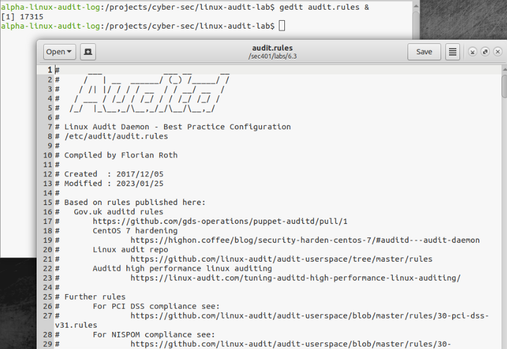
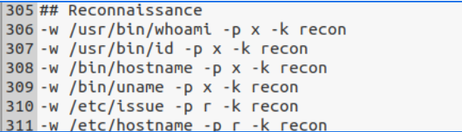
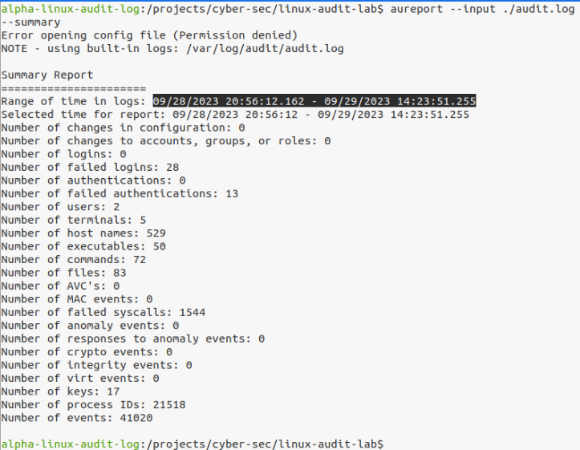
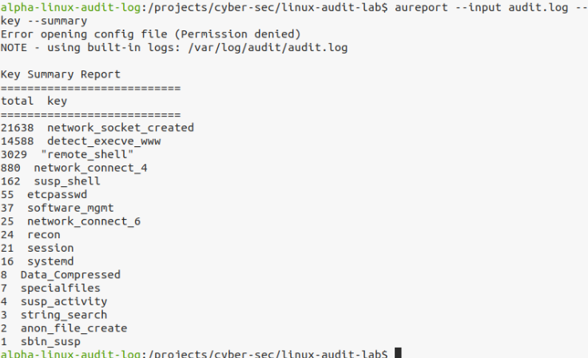

# 🚶 Walkthrough – alpha-linux-audit-log

This walkthrough guides you through the step-by-step investigation of a compromised Linux web server in Lab 6.3 using `auditd`, `Sysmon`, `Zircolite`, and NetFlow data.

---

## 🧭 Task 1: Navigate to the Lab Directory

> ⚠️ *This step is specific to the lab setup used in the course and may differ in other environments. The key takeaway is that you must navigate to the directory containing your scripts and logs before beginning your investigation.*

### 1️⃣ Change to the Lab Directory

```bash
cd /path/to/lab/script
```

📸 *(Insert screenshot here)*

This is the starting point where all scripts, logs, and config files for Lab 6.3 are located.

---

## 🧭 Task 2: Review Linux Audit Configuration

### 2️⃣ Open `audit.rules`

```bash
gedit audit.rules &
```

* Lines 1–45: Comments and rule setup
* Line 32: `-D` clears existing rules
* Lines 46+: Begin custom rules (from Florian Roth)

**Focus: Lines 306–311**
These audit rules log **reconnaissance activity**:

| Line Range | File Type    | Action (`-p`) | Purpose                             |
| ---------- | ------------ | ------------- | ----------------------------------- |
| 306–309    | Executables  | `x` (execute) | Monitor recon commands (e.g., `id`) |
| 310–311    | Config Files | `r` (read)    | Monitor reads of `/etc/issue`, etc. |


>💡 *Allows easy review of what system activities are being logged by auditd.*


>💡 *These rules watch for attacker behavior using common recon tools or files.*
---

## 🧭 Task 3: Review the Audit Log from Compromised host.

### 3️⃣ Summary of Captured Events

```bash
aureport --input ./audit.log --summary
```

>💡 *Useful for getting a quick overview of what kinds of system events were captured (Displays counts of logins, executed commands, etc.*


### 4️⃣ Summary Report Grouped by Key

```bash
aureport --input audit.log --key --summary
```

View activity tagged with rules like `recon`, `sbin_susp`, etc.


>💡 *Shows which types of activity (like recon, execution, etc.) occurred most frequently.*


### 5️⃣ View Raw Audit Log

```bash
gedit audit.log &
```

Useful for inspecting structure: each event may span multiple `type=` lines with a shared `event ID`.


>💡 *Useful for seeing the raw structure of logged events and identifying specific entries.*

---

### 6️⃣ Decode a Hex proctitle

```bash
echo -n "<hex_value>" | xxd -r -p ; echo
```

Reveals the real command behind a suspicious `proctitle` log field.

📸 *(Insert screenshot here)*

---

### 7️⃣ Use ausearch to Investigate

#### Raw Output

```bash
ausearch --input audit.log -k sbin_susp
```

#### Decoded Output

```bash
ausearch --input audit.log -k sbin_susp -i
```

* `-i` interprets hex, timestamps, UIDs
* Example output: `timeout 1 tcpdump`

📸 *(Insert before/after ausearch comparison)*

---

## 🧭 Task 4: Detection with Sigma Rules

### 8️⃣ Run Zircolite with Audit Rules

```bash
zircolite --events audit.log --ruleset rules/alpha_rules_linux.json --auditd
```

📁 Output saved to `detected_events.json`

### 9️⃣ Review Sigma Detection Results

```bash
gedit detected_events.json &
```

Key detections:

* 177× Webshell Remote Command Execution
* 11× System Info Discovery

📸 *(Insert screenshot of detection output)*

---

### 🔍 Follow up with ausearch

```bash
ausearch --input audit.log -i | grep linpeas
```

```bash
ausearch --input audit.log -p 29453 -i
```

Investigate suspicious process trees from PID 29453 → leads to `client.py`

📸 *(Insert screenshots showing parent-child process relationship)*

---

## 🧭 Task 5: Analyze Command Frequency by `www-data`

### 🔢 List All Commands by Apache User

```bash
ausearch --input audit.log -ui 33 -i | grep -oP proctitle=.* | sort | uniq -c | sort -n > all-www-data-processes.txt
```

### 📝 Open Summary File

```bash
gedit all-www-data-processes.txt &
```

* Top: uncommon commands (e.g., `linpeas.sh`)
* Bottom: frequent commands (e.g., `client.py`, `python3`)

📸 *(Insert screenshot highlighting rare vs frequent entries)*

---

## 🧭 Task 6: Compare with Pre-Intrusion Log

### 📊 Summary of Clean Log

```bash
aureport --input archive-audit.log --summary
```

### 🔍 Analyze www-data Usage (Pre-Attack)

```bash
ausearch --input archive-audit.log -ui 33 -i | grep -oP proctitle=.* | sort | uniq -c | sort -n
```

📄 Normal activity: only `/usr/sbin/apache2` run 202 times
📄 No recon or suspicious tools observed

📸 *(Insert comparison screenshot)*

---

## 🧭 Bonus: Sysmon for Linux + Network Logs

### 🗃️ Open Human-Readable Sysmon Log

```bash
gedit sysmon4linux.log &
```

Search for `client.py` activity:

```bash
grep -B 10 "client\.py" sysmon4linux.log
```

📸 *(Insert screenshot showing Sysmon event block)*

### 📡 Search Raw XML in Syslog

```bash
zcat syslog | grep "<timestamp>" | grep <PID>
```

---

## 🧭 Final Step: Confirm Network Pivoting

### 🧪 Filter RDP Traffic from NetFlow

```bash
head -1 netflow-data/pcap-derived-netflow.txt > netflow-rdp.txt

grep ":3389 " netflow-data/pcap-derived-netflow.txt | grep TCP >> netflow-rdp.txt
```

### 📖 Review Filtered Connections

```bash
gedit netflow-rdp.txt &
```

**Findings:**

* Source: `10.130.8.94` (Linux web server)
* Destination: `10.130.9.42` (Windows file server)
* Protocol: TCP/3389 (RDP)
* Observation: Large data transfer → likely exfiltration

📸 *(Insert NetFlow screenshot)*

---

## ✅ Investigation Complete

This walkthrough covered:

* `auditd` log analysis
* Zircolite + Sigma detection
* Sysmon correlation
* NetFlow pivot detection

Return to `README.md`, `FINDINGS.md`, or `TIMELINE.md` for full documentation.
