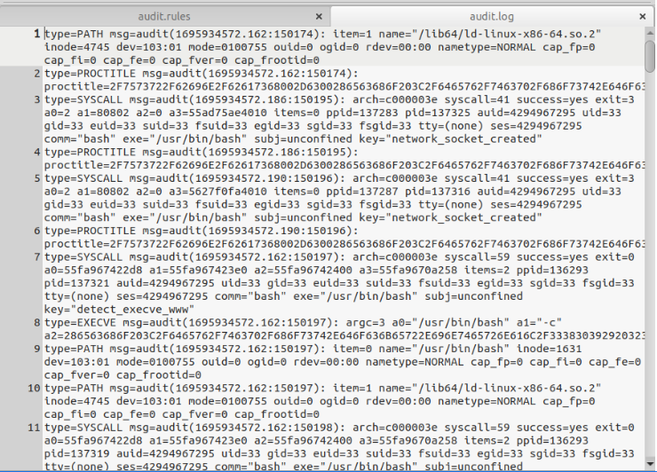

# 🚶 Walkthrough – alpha-linux-audit-log

This walkthrough guides you through the step-by-step investigation of a compromised Linux web server in Lab 6.3 using `auditd`, `Sysmon`, `Zircolite`, and NetFlow data.

---

## 🧭 Task 1: Navigate to the Lab Directory

> ⚠️ *This step is specific to the lab setup used in the course and may differ in other environments. The key takeaway is that you must navigate to the directory containing your scripts and logs before beginning your investigation.*

### 1️⃣ Change to the Lab Directory

```bash
cd /path/to/lab/script
```

📸 *(Insert screenshot here)*

This is the starting point where all scripts, logs, and config files for Lab 6.3 are located.

---

## 🧭 Task 2: Review Linux Audit Configuration

### 2️⃣ Open `audit.rules`

```bash
gedit audit.rules &
```

* Lines 1–45: Comments and rule setup
* Line 32: `-D` clears existing rules
* Lines 46+: Begin custom rules (from Florian Roth)

**Focus: Lines 306–311**
These audit rules log **reconnaissance activity**:

| Line Range | File Type    | Action (`-p`) | Purpose                             |
| ---------- | ------------ | ------------- | ----------------------------------- |
| 306–309    | Executables  | `x` (execute) | Monitor recon commands (e.g., `id`) |
| 310–311    | Config Files | `r` (read)    | Monitor reads of `/etc/issue`, etc. |


>💡 *Allows easy review of what system activities are being logged by auditd.*


>💡 *These rules watch for attacker behavior using common recon tools or files.*
---

## 🧭 Task 3: Review the Audit Log from Compromised host.

### 3️⃣ Summary of Captured Events

```bash
aureport --input ./audit.log --summary
```

>💡 *Useful for getting a quick overview of what kinds of system events were captured (Displays counts of logins, executed commands, etc.*


### 4️⃣ Summary Report Grouped by Key

```bash
aureport --input audit.log --key --summary
```

View activity tagged with rules like `recon`, `sbin_susp`, etc.


>💡 *Shows which types of activity (like recon, execution, etc.) occurred most frequently.*


### 5️⃣ View Raw Audit Log

```bash
gedit audit.log &
```

Useful for inspecting structure: each event may span multiple `type=` lines with a shared `event ID`. In addition, some fields (like proctitle) in audit logs look hard to read — they’re in hex format.


>💡 *For viewing the raw structure of logged events and identifying specific entries.*

---

### 6️⃣ Decode a Hex proctitle w/ xxd or Cyberchef

```bash
echo -n "<hex_value>" | xxd -r -p ; echo
```


>💡 *Reveals the real command behind a suspicious `proctitle` log field.*

---

### 7️⃣ Use ausearch to Investigate
Manually converting hex to ASCII is tedious, but `ausearch -i` can do it for you by auto-decoding values and resolving IDs.

Let’s focus on a single event tagged with `sbin_susp` (suspicious use of privileged system binaries).

First, view it **without** `-i` to see the raw data. Then re-run **with** `-i` to compare decoded output.

#### Raw Output

```bash
ausearch --input audit.log -k sbin_susp
```

>💡 *Shows raw entries for potentially suspicious privileged binary usage.*
>
>💡 *Results show 5 different records for Event ID 152873. The 1st record is the type PROCTITLE and the proctitle field which is hex-encoded.*

#### Decoded Output

```bash
ausearch --input audit.log -k sbin_susp -i
```

>💡 *Searches for events tagged sbin_susp and decodes hex + ID fields for easier readability.*
>
>💡 *proctitle is now readable*

* `-i` interprets hex, timestamps, UIDs
* Example output: `timeout 1 tcpdump`

---

## 🧭 Task 4: Detection with Sigma Rules

### 8️⃣ Run Zircolite with Audit Rules

```bash
zircolite --events audit.log --ruleset rules/alpha_rules_linux.json --auditd
```

>💡 *Used for local threat detection auditd tells Zircolite how to parse the log format.*
>
>📁 *Output saved to `detected_events.json`*
>
>🗝️ *Key detections: 177× Webshell Remote Command Execution and 11× System Info Discovery

### 9️⃣ Review Sigma Detection Results

```bash
gedit detected_events.json &

```
#### First Flagged Event


>💡 *This event indicates that a shell (/usr/bin/dash) was executed, and its parent was process 29453*

#### Second Flagged Event

>💡 *This confirms that the sh shell (PID 138330) launched linpeas.sh, showing a clear escalation of activity*
>
>💡 *Together with the first flagged event, this provides a parent-child chain: → 29453 (initial payload) → sh → linpeas.sh

### ❓ What Happened?
&nbsp;&nbsp;&nbsp;&nbsp;&nbsp;A script named `linpeas.sh` was executed — a common recon tool used after compromise.

### 🔎 How do we Know

- **Event 1** shows a process (`sh`) launching with **PID `138330`** and **parent PID `29453`**.  
  This suggests a shell was spawned, possibly via a webshell or command injection.

- **Event 2** shows the same **PID `138330`** now acting as the **parent** of a new process — `linpeas.sh`,  
  confirming that the attacker used the shell to run the recon script.

---

### 🔍 Follow up with ausearch

```bash
ausearch --input audit.log -i | grep linpeas
```

```bash
ausearch --input audit.log -p 29453 -i
```

Investigate suspicious process trees from PID 29453 → leads to `client.py`

📸 *(Insert screenshots showing parent-child process relationship)*

---

## 🧭 Task 5: Analyze Command Frequency by `www-data`

### 🔢 List All Commands by Apache User

```bash
ausearch --input audit.log -ui 33 -i | grep -oP proctitle=.* | sort | uniq -c | sort -n > all-www-data-processes.txt
```

### 📝 Open Summary File

```bash
gedit all-www-data-processes.txt &
```

* Top: uncommon commands (e.g., `linpeas.sh`)
* Bottom: frequent commands (e.g., `client.py`, `python3`)

📸 *(Insert screenshot highlighting rare vs frequent entries)*

---

## 🧭 Task 6: Compare with Pre-Intrusion Log

### 📊 Summary of Clean Log

```bash
aureport --input archive-audit.log --summary
```

### 🔍 Analyze www-data Usage (Pre-Attack)

```bash
ausearch --input archive-audit.log -ui 33 -i | grep -oP proctitle=.* | sort | uniq -c | sort -n
```

📄 Normal activity: only `/usr/sbin/apache2` run 202 times
📄 No recon or suspicious tools observed

📸 *(Insert comparison screenshot)*

---

## 🧭 Bonus: Sysmon for Linux + Network Logs

### 🗃️ Open Human-Readable Sysmon Log

```bash
gedit sysmon4linux.log &
```

Search for `client.py` activity:

```bash
grep -B 10 "client\.py" sysmon4linux.log
```

📸 *(Insert screenshot showing Sysmon event block)*

### 📡 Search Raw XML in Syslog

```bash
zcat syslog | grep "<timestamp>" | grep <PID>
```

---

## 🧭 Final Step: Confirm Network Pivoting

### 🧪 Filter RDP Traffic from NetFlow

```bash
head -1 netflow-data/pcap-derived-netflow.txt > netflow-rdp.txt

grep ":3389 " netflow-data/pcap-derived-netflow.txt | grep TCP >> netflow-rdp.txt
```

### 📖 Review Filtered Connections

```bash
gedit netflow-rdp.txt &
```

**Findings:**

* Source: `10.130.8.94` (Linux web server)
* Destination: `10.130.9.42` (Windows file server)
* Protocol: TCP/3389 (RDP)
* Observation: Large data transfer → likely exfiltration

📸 *(Insert NetFlow screenshot)*

---

## ✅ Investigation Complete

This walkthrough covered:

* `auditd` log analysis
* Zircolite + Sigma detection
* Sysmon correlation
* NetFlow pivot detection

Return to `README.md`, `FINDINGS.md`, or `TIMELINE.md` for full documentation.
